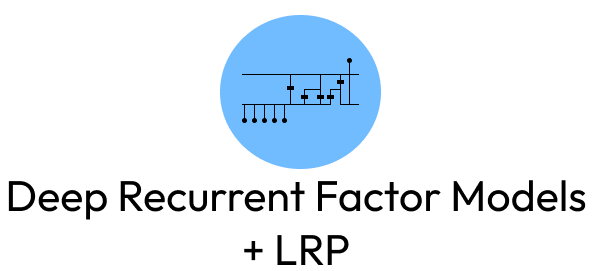
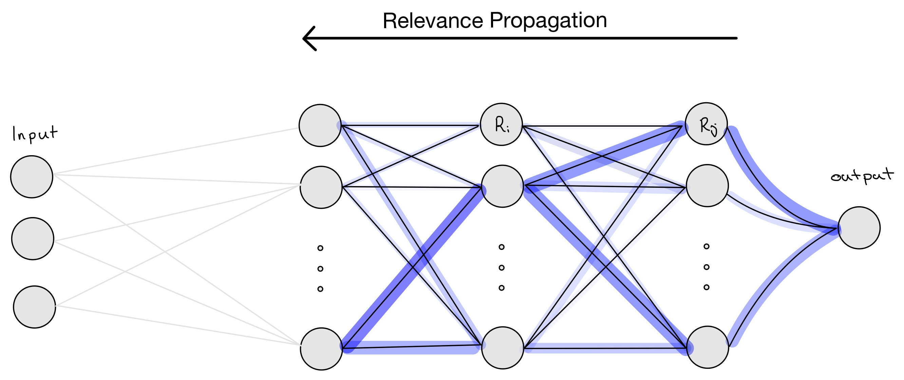
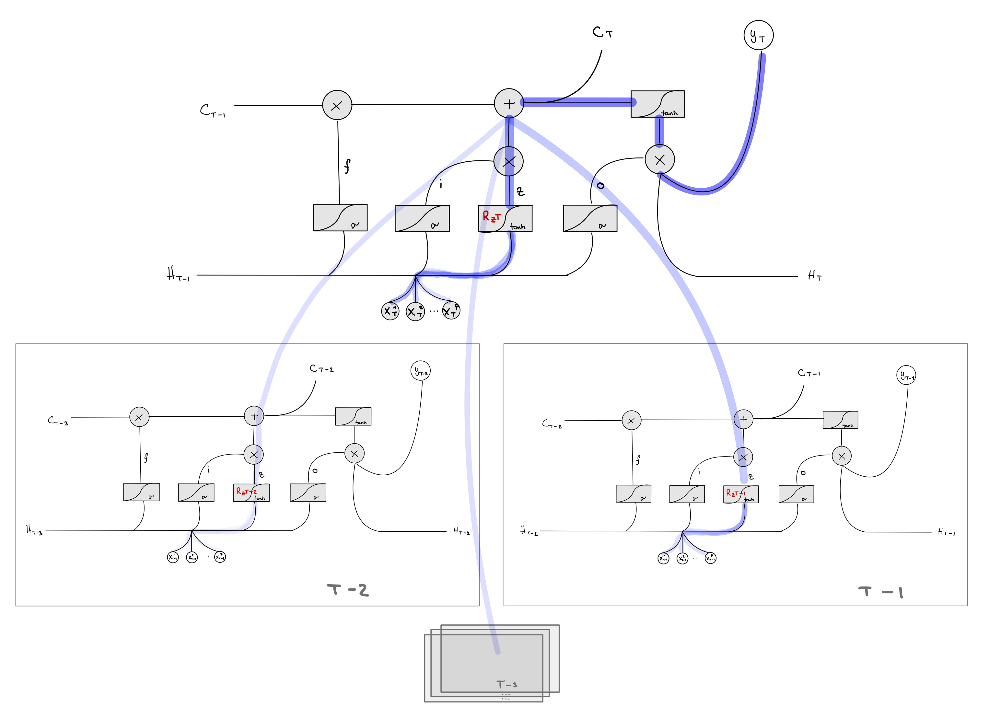

<p align="center"></p>
<div align="center">


[](./License)

</div>


> **Deep Recurrent Factor Model** is a term coined by the authors of the paper [*Deep Recurrent Factor Model: Interpretable Non-Linear and Time-Varying
>Multi-Factor Model*](https://arxiv.org/pdf/1901.11493.pdf). The authors challenge the idea of linear factor models to predict stock returns and use Long-Short-Term Memory networks (LSTM) in conjunction with layer-wise-relevance propagation (LRP) to construct a time-varying factor model that outperforms equivalent linear models, whilst providing insights into the relvance of particular factors in the prediction.


<div align=center>
This repository provides <b>classes</b>, <b>functions</b> and <b>notebooks</b>
to test <b>Deep Recurrent Factor Models</b> on the US-stock market.
</div>

---

  

# [Contents](#contents)

- [Basic Overview 📄](#basic-overview-)
- [Getting Started 🚀](#getting-started-)
  - [Installing Dependencies 🛠️](#installing-dependencies-️)
  - [Building a Model 🏗️](#building-a-model-️)
  - [Layerwise Relevance Propagation (LRP) 🔍](#lrp)
- [Example 🌟](#example-)
  - [Data 📊](#data-)
- [References 📚](#references-)
- [Contact  📬](#contact--)


# [Basic Overview 📄](#basic-overview)
Welcome to the **Deep Recurrent Factor Model + LRP** Repository. 
By building upon familiar modules like `Keras` and `Tensorflow`, this repository allows you to create deep LSTM networks and fascilitate LRP through the provided classes and methods.


The provided classes and methods take care of the complex task of backpropagating relevance through any variation of custom `Input`, `LSTM`, 
`Dense` or `Dropout` layers. This means you can build deep feed-forward LSTM networks and effortlessly backpropagate  relvance scores for predictions. The model builds on top of the [Functional API by Keras](https://keras.io/guides/functional_api/) to provide compatability with various functionalities that come with `Keras` and `Tensorflow`. 

 In an [Example](#example-) we explore and replicate the approach suggested in the paper [*Deep Recurrent Factor Model: Interpretable Non-Linear and Time-Varying Multi-Factor Model*](https://arxiv.org/pdf/1901.11493.pdf) to test our implementation of customs LSTM models with LRP on the US-stock market.


# [Getting Started 🚀](#getting-started)

In order to get started clone the GitHub repository to your local machine:
```bash
git clone https://github.com/ACM40960/DeepRecurrentFactorModels
```

## [Installing Dependencies 🛠️](#intalling-dependencies)
- Make sure to have python 3.11+ installed - if not, download the  [latest version of Python 3](https://www.python.org/downloads/).

- Install all necessary dependencies:

    ```bash
    cd ./project-mkaywins
    pip install -r requirements.txt
    ```

## [Building a Model 🏗️](#build-a-model)

If you want to build your own deep LSTM model, then you need to 
use the [Functional API by Keras](https://keras.io/guides/functional_api/) in cunjunction with the provided LSTM layer `CustomLSTM` and the provided model class `CustomModel`.


We show in an exmaple below how to build such a model:

```python
# Build an example model
import pandas as pd
import numpy as np
import matplotlib.pyplot as plt

# Define input dimensions
timesteps = 5
input_dim = 16
input_shape = (timesteps, input_dim)

#1) Create input layer
input_layer = Input(shape=input_shape, name="Input")

#2) Create a CustomLSTM layer
lstm_output, hidden_state, cell_state = CustomLSTM(units=16, return_sequences=False,
                                                return_state=True,
                                                kernel_regularizer=L2(0.02),
                                                name="CustomLSTM_1")(input_layer)
#3) Apply dropout to LSTM output
dropout1 = Dropout(0.2)(lstm_output)

#4) Create a Dense layer
dense1 = Dense(16, kernel_regularizer=L2(0.02), name="Dense_1")(dropout1)

#5) Apply dropout to dense1 output
dropout2 = Dropout(0.2)(dense1)

#6) Create the final output layer
output_layer = Dense(1, kernel_regularizer=L2(0.02), name="Dense_2_Final")(dropout2)

# Create an instance of your custom model
custom_model = CustomModel(inputs=input_layer, outputs=output_layer)

# Compile the model
custom_model.compile(optimizer='adam', loss='mean_squared_error', metrics=['mae'])

# # Generate some example training data (replace this with your actual data)
num_samples = 100
X_train = np.random.rand(num_samples, timesteps, input_dim)
y_train = np.random.rand(num_samples, 1)

# Train the model
custom_model.fit(X_train, y_train, epochs=10, batch_size=32)

```

## [Layerwise Relevance Propagation (LRP) 🔍](#lrp)

After fitting the model we can proceed to compute the relevance for each input feature.
To backpropagate relevance through the entire network, i.e. from the output layer to the input layer,
we use the approach suggested by [Arras et al. (2017)](https://arxiv.org/abs/1706.07206).
In order to propagate relevance between layers (including LSTM layers and linear layers), we use the following 
relevance distribution rule:

```math
R_{i\leftarrow j} = \frac{z_i \cdot w_{ij} + \frac{\epsilon \cdot \text{sign}(z_j) + \delta \cdot b_j }{N}}{z_j + \epsilon \cdot \text{sign}(z_j)} \cdot R_j,
```

where 
- $R_j$ represents the relvance of nodes in upper layers, 
- $z_i$ is the activation of nodes in the lower layer
- $z_j$ is the activtion of nodes in the upper layer
- $w_{ij}$ are the weights connecting nodes from lower and upper layers
- $\epsilon$ is a small number to avoid division by 0 - it is usually set to 0.001
- δ is a multiplicative factor that is either 1 or 0 (see [details](https://arxiv.org/abs/1706.07206))

The rule propagates relevance from a higher layer to a lower layer using a fraction of the 
relvance for the higher layer for each node in the lower layer. We initilaise the relevance for our 
purposes with the final prediction $y_{T+1}$ itself.

Here is an illustration of how the relevance is backpropagted in the network. The intensity and size of the blue lines represent the amount of relevance that is propagated onto the next layer.




The propagation of relevance through a LSTM cell is not straight-forward as there a multiple components 
envolved in a single LSTM cell that interact with each other (signals, gates, etc.) to feed the provided 
input through the system. Thus, we cannot simple use the 'linear' backpropagation rule from above.

For the backpropagation of relevance in a LSTM cell we provide two approaches:

1. the approach suggested by [Arras et al. (2019)](https://arxiv.org/pdf/1909.12114.pdf), which discountes the relevance scores by 'forget factors' of the LSTM cell at each point in time.

2. the approach suggested by [Arjona-Medina, et al. (2019) - A8.4.2](https://arxiv.org/pdf/1806.07857.pdf), who make a list of assumptions on the LSTM cell archticeture and characteristics themselves to facilitate relevance propagation without disounting relevance scores through 'forget factors' of the LSTM cell

Both approaches use the "signal takes it all" approach to handle the distribution of relevance scores in multiplicative connections within the LSTM cell (refer to the paper for [details](https://arxiv.org/pdf/1909.12114.pdf)). 

Here is an illustration of how the relevance is backpropagated through each LSTM cell.




Let us see how we computed relevance and conduct relevance propagation in our custom model:

```python
# Create sample input data to test LRP
input_data = np.random.rand(1, timesteps, input_dim) # sample input

# Copmute LRP for entire network
custom_model.backpropagate_relevance(input_data, type="arras") # Arras et al. (2019)
custom_model.backpropagate_relevance(input_data, type="rudder") # Arjona-Medina, et al. (2019)
```
As the input to the model is of dimensions `(timesteps, input_dim) = (5, 16)`, the resulting relevance scores will have the same dimensions.


> One can decide on whether to aggregate relevance scores for `LSTM` layers. 
> One can aggregate the relevance scores before propagating them to the next lower layer, 
> by means of the `aggregate` argument. 
> - `aggregate = True:   ` the average across all `timesteps` is propagated to the next layer
> - `aggregate = False:   ` the relevance score corresponding to the most recent input is
> propagated to the next layer
>
> Note: This rule is only relevant if you use `CustomLSTM` layer with the argument `return_sequences` set to `True`.

```python
# aggregate relvance across time - use the most recent input to the layer for relvance 
custom_model.backpropagate_relevance(input_data, aggregate=False, type="arras") 

# aggregate relvance across time - average relevance of features across time
custom_model.backpropagate_relevance(input_data, aggregate=True, type="rudder")
```


# [Example 🌟](#example)

We provide an example of the classes and methods in this repository and 
test our implementation on the US-stock market.
Hence, please refer to the following notebook for the analysis and results: 


- [Replication of Experiments in <i>'Deep Factor Models'</i>](./Notebooks/DeepFactorModels.ipynb)


- You can launch the notebook directly in your browser using binder:

    [](https://mybinder.org/v2/gh/ACM40960/DeepRecurrentFactorModels/main?labpath=Notebooks%2FDeepFactorModels.ipynb)

- You can find the literature review for this analysis [here](./static/Files/LiteratureReview.pdf).

- For a summary of MSE, RMSE scores for deep recurrent facor models please refer to this [Excel File](./Data/Results/LSTMResults.xlsx).

- Presentation slides 🛝 for the university course can be found [here](./static/Files/presentation.pdf)


## [Data 📊](#data)

- We gatherd the factor data from the openly available factor data set provided by [Andrew Y. Chen and Tom Zimmermann](https://www.openassetpricing.com/data/)

-  You can find a description of the factor data [here](https://docs.google.com/spreadsheets/d/1WLiuWh4Uq_0wK230yXpczsb_PON0z91e_TAcUtb0rkU/edit?pli=1#gid=312865186)

- We describe how we try to map features from the [Open Asset Pricing Data Set](https://www.openassetpricing.com/data/) to factors used in the paper on [deep recurrent factor models]((https://arxiv.org/pdf/1901.11493.pdf)) in [here](./static/Data/FactorDescription.md).

# [References 📚](#references)


- Arjona-Medina, J. A., Gillhofer, M., Widrich, M., Unterthiner, T., Brandstetter, J., & Hochreiter, S. (2019). Rudder: Return decomposition for delayed rewards. Advances in Neural Information Processing Systems, 32.

- Arras, L., Montavon, G., Müller, K. R., & Samek, W. (2017). Explaining recurrent neural network predictions in sentiment analysis. arXiv preprint arXiv:1706.07206.

- Arras, L., Arjona-Medina, J., Widrich, M., Montavon, G., Gillhofer, M., Müller, K. R., ... & Samek, W. (2019). Explaining and interpreting LSTMs. Explainable ai: Interpreting, explaining and visualizing deep learning, 211-238.

- Chen, A. Y., & Zimmermann, T. (2021). Open source cross-sectional asset pricing. Critical Finance Review, Forthcoming.

- Nakagawa, K., Ito, T., Abe, M., & Izumi, K. (2019). Deep recurrent factor model: interpretable non-linear and time-varying multi-factor model. arXiv preprint arXiv:1901.11493.


# [Contact  📬](#contact)

- Maximilian Kuttner: maximilian.kuttner@ucdconnect.ie
- Alissia Hrustsova:  alissia.hrustsova@ucdconnect.ie

