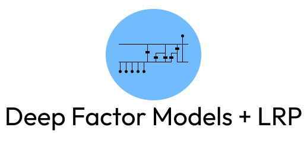

<p align="center"></p>
<div align="center">


[](./License)

</div>

---

> **Deep Recurrent Factor Model** is a term coined by the authors of the paper [*Deep Recurrent Factor Model: Interpretable Non-Linear and Time-Varying
> Multi-Factor Model*](https://arxiv.org/pdf/1901.11493.pdf). The authors challenge the idea of linear factor models to predict stock returns and use Long-Short-Term Memory networks (LSTM) in conjunction with layer-wise-relevance propagation (LRP) to construct a time-varying factor model that outperforms equivalent linear models, whilst providing insights into the relvance of particular factors in the prediction.


<div align=center>
This repository provides <b>classes</b>, <b>functions</b> and <b>notebooks</b>
to test <b>Deep Recurrent Factor Models</b> on the US-Stock market.
</div>

## Basic Overview
Welcome to the **Deep Recurrent Factor Model** Repository. This repository introduces a fresh approach to deep feed-forward LSTM networks, featuring a new layer class that enables easy layerwise relevance propagation. 

By building upon the familiar `keras.layers` module, this repository allows you to create deep LSTM networks and to fascilitate LRP.
The key highlight is the `CustomModel` class, which takes care of the complex task of backpropagating relevance through any variation of custom `Input`,`LSTM`, 
`Dense` or `Dropout` layers, which are built using the `keras` functional API. 

This means you can now design LSTM-Dense layer combinations and extract feature and timestep relevance effortlessly. Explore this repository to harness enhanced interpretability and customization in your LSTM network designs.

The relvance propagation algorithm is taken from <a href=https://proceedings.neurips.cc/paper_files/paper/2019/file/16105fb9cc614fc29e1bda00dab60d41-Paper.pdf> Arjona-Medina, J. A., Gillhofer, M., Widrich, M., Unterthiner, T., Brandstetter, J., & Hochreiter, S. (2019). Rudder: Return decomposition for delayed rewards. Advances in Neural Information Processing Systems, 32.</a> as there is little inforation on how the atuhors of [*Deep Recurrent Factor Model*](https://arxiv.org/pdf/1901.11493.pdf) implemented the algorithm. We also use the 
linear relevance propagation function by [Leila Arras](https://github.com/ArrasL/LRP_for_LSTM).


Note: You can find the literature review for this project [here](./static/LiteratureReview.pdf).

## Documentation


## Getting Started

Install all necessary dependencies
```bash
pip install -r requirements.txt
```


